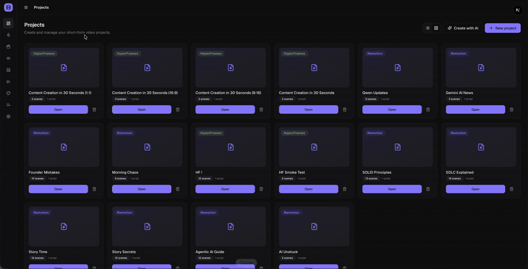
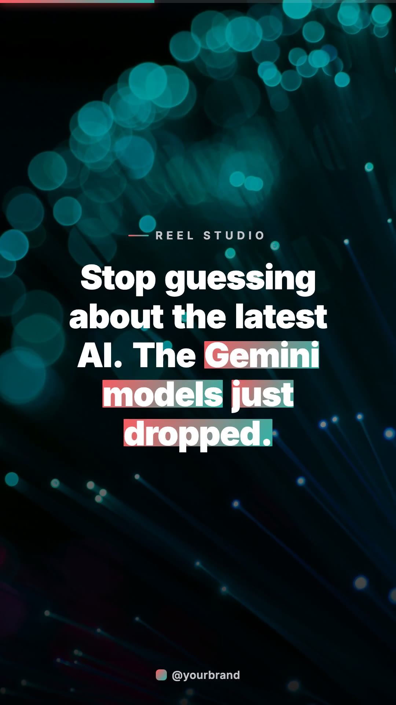
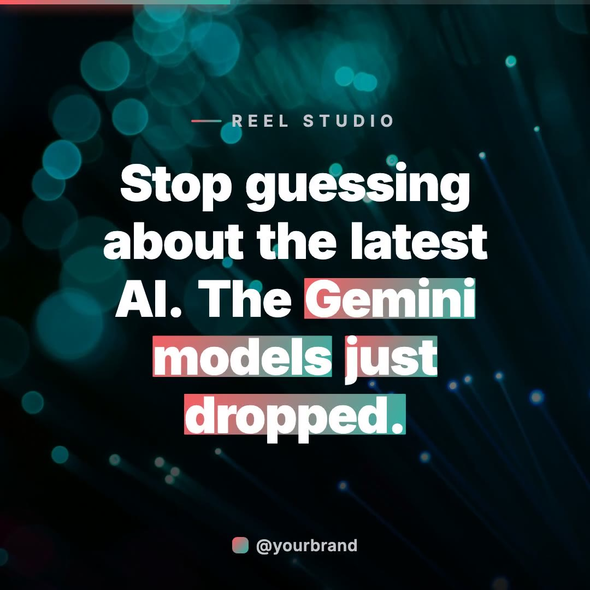
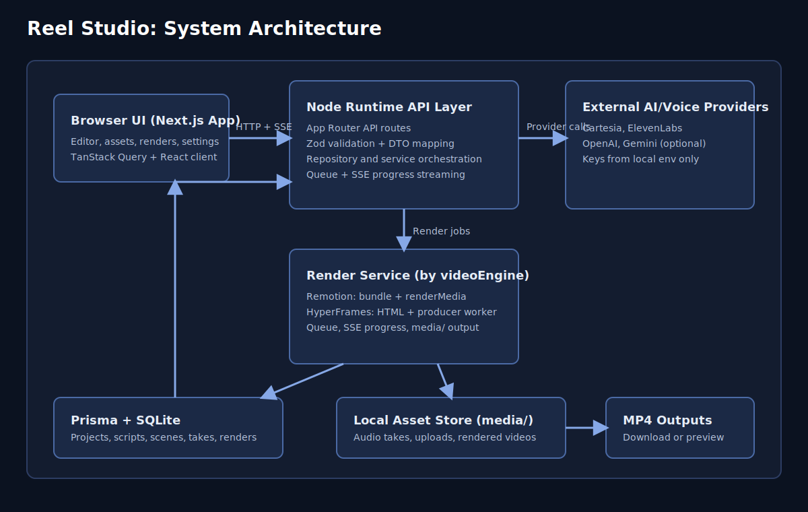
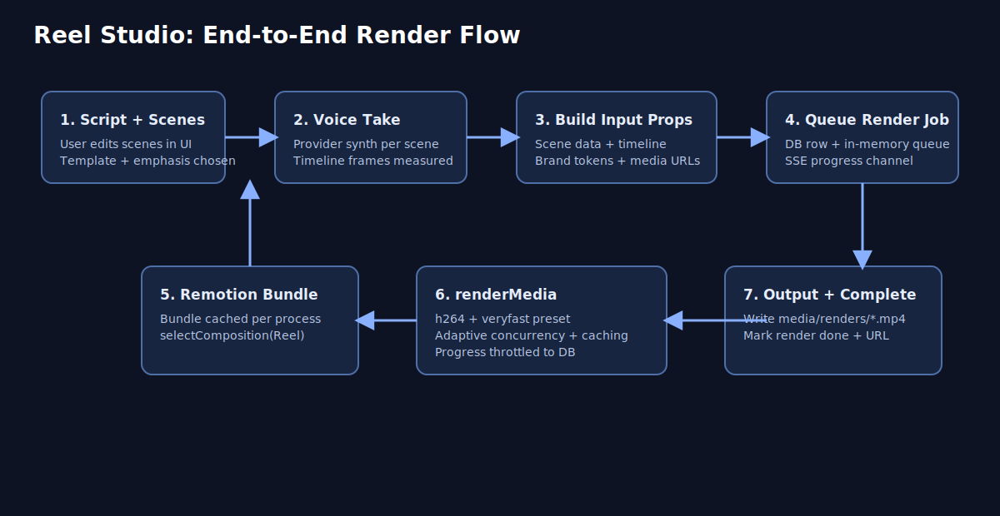

# Reel Studio

[](https://opensource.org/licenses/MIT)
[](https://nodejs.org/)
[](mcp/README.md)

**Turn a script into a complete short-form video locally, with an MCP server for AI agents.**

Local-first open-source studio for **Instagram Reels**, **YouTube Shorts**,
**TikTok**, **Facebook**, **X (Twitter)**, **LinkedIn**, and other social
formats (9:16, 16:9, 1:1). Build with AI scene planning, voiceovers, motion
templates, local MP4 export, multi-speaker **podcasts**, and a built-in
**Model Context Protocol (MCP)** server so tools like Cursor can drive
production workflows.

**Local-first. Open source. Your projects stay on your machine.**

> App code is **MIT**. Projects may use **HyperFrames** (Apache-2.0) or
> **Remotion** (separate commercial terms, not OSI). See
> [Licensing](#licensing-summary) and [docs/LICENSING.md](docs/LICENSING.md).



[Quick start](#quick-start) · [MCP](mcp/README.md) · [Roadmap](ROADMAP.md) · [Contributing](CONTRIBUTING.md)

## From idea to video

1. Paste or write your script
2. Let AI split it into scenes (or edit manually)
3. Choose backgrounds and motion templates
4. Generate or upload a voiceover
5. Preview in **9:16**, **16:9**, or **1:1**
6. Render the final MP4 locally, or drive the flow with **MCP**

## Example outputs

| Format | Preview | File |
| --- | --- | --- |
| Portrait 9:16 (Reels, Shorts, TikTok, Stories) | [](docs/assets/examples/portrait-demo.mp4) | [MP4](docs/assets/examples/portrait-demo.mp4) |
| Landscape 16:9 (YouTube, X, LinkedIn, Facebook) | [](docs/assets/examples/landscape-demo.mp4) | [MP4](docs/assets/examples/landscape-demo.mp4) |
| Square 1:1 (Instagram, Facebook feed) | [](docs/assets/examples/square-demo.mp4) | [MP4](docs/assets/examples/square-demo.mp4) |

**Podcast sample:** [MP3](docs/assets/examples/podcast-demo.mp3) · [WAV](docs/assets/examples/podcast-demo.wav)

## What you get

### Create

- Script and scene editor
- AI storyboard planning (optional Gemini / OpenAI)
- Portrait, landscape, and square formats
- Stock backgrounds (optional Unsplash) and motion planning

### Voice

- Browser Kokoro (Apache-2.0, no key) and Web Speech preview
- Cartesia and ElevenLabs (optional keys)
- Optional self-hosted [VoiceForge](https://github.com/mohitkale/voiceforge)
- Full-reel or per-scene takes, plus multi-speaker **podcasts**

### Design

- Motion templates for Remotion and HyperFrames
- Brand kits, captions, background music (bundled CC0)
- Style and Energy looks (for example clean story, bold hook)

### Export and automate

- Local MP4 rendering with queue and progress
- Docker isolation bound to `127.0.0.1`
- **MCP server** for AI-assisted video and podcast workflows ([mcp/README.md](mcp/README.md))

## Video engines

| | HyperFrames | Remotion |
| --- | --- | --- |
| Licence | **Apache-2.0** | Remotion License (not OSI) |
| Templates | HTML motion (`hf-*`) | React compositions |
| Best for | Open-source-safe demos and forks | Rich React template ecosystem |

See [docs/VIDEO_ENGINES.md](docs/VIDEO_ENGINES.md).

## Local vs optional cloud

| Feature | Local option | Optional cloud |
| --- | --- | --- |
| Voice preview | Web Speech | n/a |
| Voice generation | Kokoro / VoiceForge | ElevenLabs, Cartesia |
| Video render | HyperFrames or Remotion (on your machine) | n/a |
| AI planning | Manual | Gemini, OpenAI |
| Backgrounds | Upload / gradients | Unsplash |
| Music | Bundled CC0 / upload | Jamendo |

See [docs/LOCAL_FIRST.md](docs/LOCAL_FIRST.md).

## Quick start

```bash
git clone https://github.com/mohitkale/reel-studio.git
cd reel-studio
nvm use          # Node 22+
npm install
npm run setup
npm run dev
```

Open [http://localhost:3000](http://localhost:3000).

Or run `npm run demo` (setup + dev server). No cloud keys are required for the
seeded HyperFrames demo or Kokoro voices.

### Manual fallback

```bash
cp .env.example .env.local
npm run db:push
npm run seed:demo-brandkit
npm run seed:demo-project
npm run seed:demo-podcast
npm run dev
```

### Docker

```bash
cp .env.example .env.local   # optional keys
docker compose up --build
```

Compose publishes **`127.0.0.1:3000` only** (not your LAN).

## MCP integration

With the app running, generate a token in **Settings → AI tools / MCP**, then:

```bash
npm run mcp
```

Video and podcast tools: [mcp/README.md](mcp/README.md).

## Security

Built for trusted localhost use. Do not expose it on the public internet without
your own auth layer. See [SECURITY.md](SECURITY.md).

## Roadmap

Near-term: simpler install, more HyperFrames templates, caption editing, export
presets, and template authoring docs. Full list: [ROADMAP.md](ROADMAP.md).

## Contributing

- [CONTRIBUTING.md](CONTRIBUTING.md)
- [CODE_OF_CONDUCT.md](CODE_OF_CONDUCT.md)
- [CONTRIBUTORS.md](CONTRIBUTORS.md)

### Contributors

- **[Mohit Kale](https://github.com/mohitkale)**: creator and maintainer
- **[Cursor](https://cursor.com)** / **[Cursor Agent](https://github.com/cursoragent)**: pair programmer and first AI contributor

## Architecture





Stack: Next.js App Router, TypeScript, Prisma + SQLite, Remotion and/or
HyperFrames, TanStack Query, Zod.

### Key modules

1. `src/app`: pages and API routes (including `/podcasts`)
2. `src/library`: repositories, render and take services, storage
3. `src/engines`: Remotion / HyperFrames adapters
4. `src/providers`: AI and voice providers
5. `src/compositions`: Remotion templates
6. `scripts/`: setup, seeds, HyperFrames worker

## Available scripts

| Script | Purpose |
| --- | --- |
| `npm run setup` | First-run setup (safe to re-run) |
| `npm run demo` | Setup + start dev server |
| `npm run dev` | Start development server |
| `npm run build` / `start` | Production build / run |
| `npm run lint` / `typecheck` / `test` | Quality checks |
| `npm run security:scan` | Secret pattern scan |
| `npm run prepare:hooks` | Enable `.githooks` |
| `npm run db:push` | Push Prisma schema |
| `npm run seed:demo-project` | Seed HyperFrames demo reel |
| `npm run seed:demo-podcast` | Seed short demo podcast |
| `npm run seed:demo-brandkit` | Seed Coral Harbor brand kit |
| `npm run seed:assets` | Sample SVG/Lottie assets |
| `npm run mcp` | MCP server |
| `npm run studio` | Remotion Studio |

## Environment variables

See [`.env.example`](.env.example). Minimum for local use without cloud
providers: `DATABASE_URL` (created by setup).

## Licensing summary

| Component | Terms |
| --- | --- |
| Reel Studio app, templates, MCP code | **MIT** |
| Bundled music (`public/music/`) | **CC0** |
| **Remotion** | **Remotion License** ([details](https://www.remotion.dev/license)) |
| **HyperFrames** | **Apache-2.0** |
| Kokoro TTS | Apache-2.0 |
| Optional cloud providers | Each vendor's terms |
| VoiceForge engines ([repo](https://github.com/mohitkale/voiceforge)) | Per-engine (may be non-commercial) |

Full matrix: **[docs/LICENSING.md](docs/LICENSING.md)**.

## More docs

- [docs/LOCAL_FIRST.md](docs/LOCAL_FIRST.md)
- [docs/VIDEO_ENGINES.md](docs/VIDEO_ENGINES.md)
- [docs/VOICE_PROVIDERS.md](docs/VOICE_PROVIDERS.md)
- [docs/TEMPLATE_AUTHORING.md](docs/TEMPLATE_AUTHORING.md)
- [docs/LICENSING.md](docs/LICENSING.md)
- [CHANGELOG.md](CHANGELOG.md)
