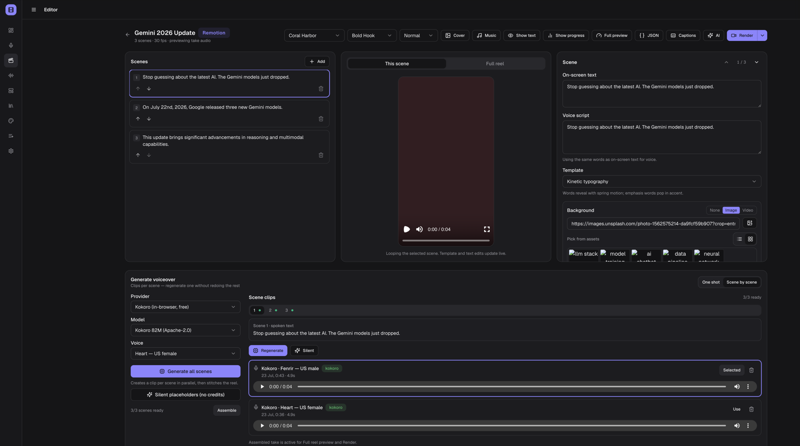
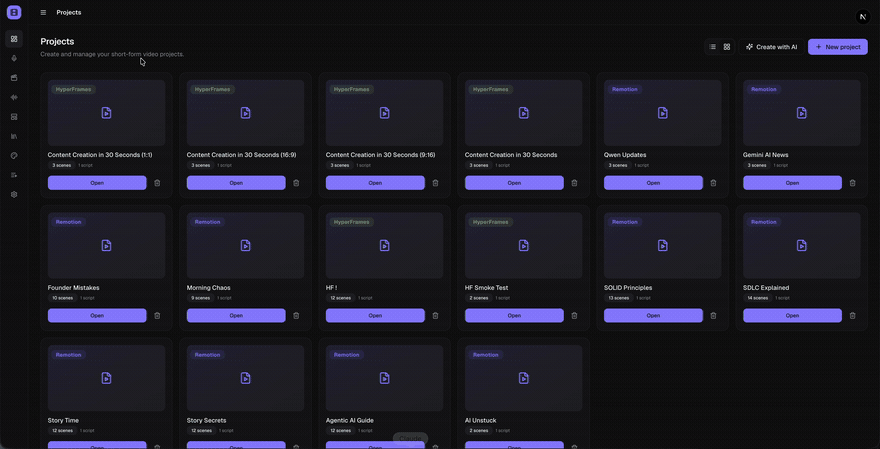
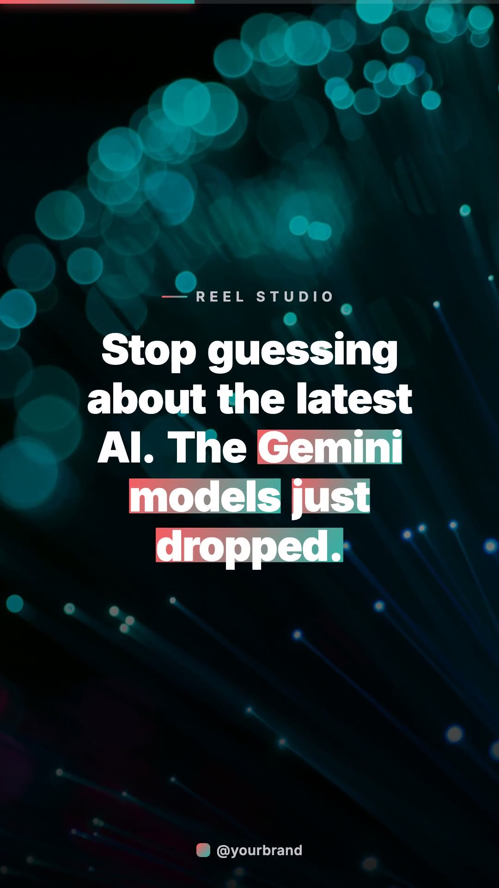
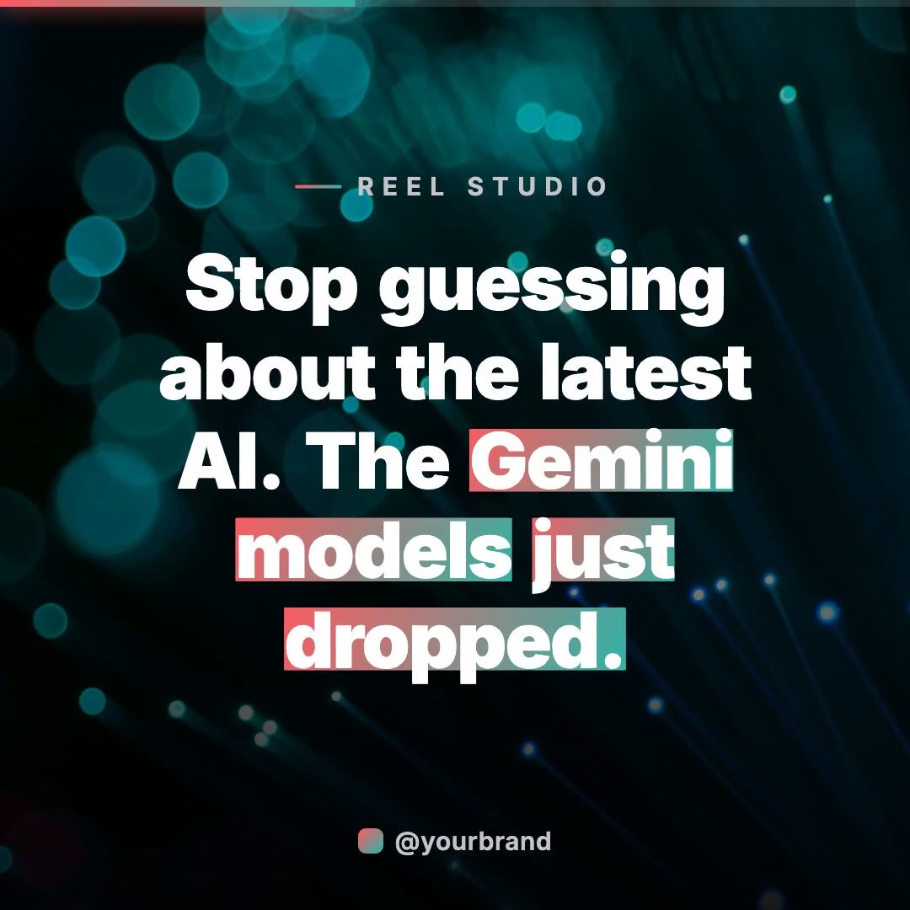
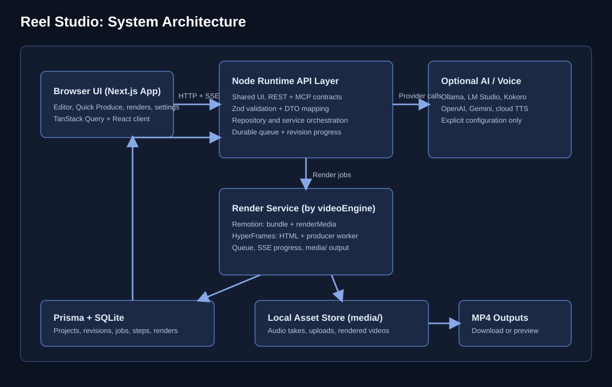
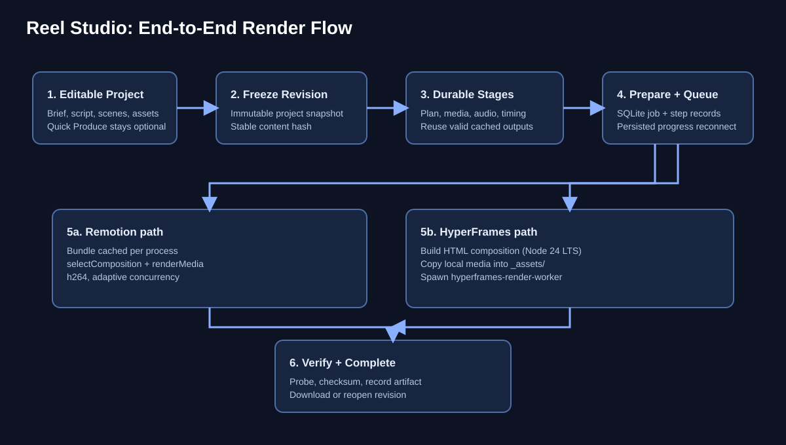

# Reel Studio

[](https://opensource.org/licenses/MIT)
[](https://nodejs.org/)
[](mcp/README.md)

**Turn a brief, script, screenshot, recording, or podcast into finished local content.**

Create Reels, Shorts, explainers, voiceovers, podcasts, and audiograms with a
guided production flow, six production presets, optional AI, and local media
rendering. Use the built-in **MCP server** for bounded unattended production.

Also supports Instagram, YouTube Shorts, TikTok, Facebook, X (Twitter), and
other social formats in **9:16**, **16:9**, and **1:1**.

> **Project status: 0.4 local production release.** The credential-free path,
> both render engines, durable jobs, and the advertised example matrix are
> release-tested. Provider integrations remain optional and may evolve.

**MIT-licensed app. Local-first.** Projects and renders stay on your machine
unless you explicitly enable a cloud provider.

> App code is **MIT**. Projects may use **HyperFrames** (Apache-2.0) or
> **Remotion** (separate commercial terms, not OSI). See
> [Licensing](#licensing-summary) and [docs/LICENSING.md](docs/LICENSING.md).

<p align="center">
  
</p>



If Reel Studio helps your workflow, star the repository and tell us which
template or voice provider you want next.

[Quick start](#quick-start) · [Creator guide](docs/CREATOR_GUIDE.md) · [Walkthroughs](docs/WALKTHROUGHS.md) · [MCP](mcp/README.md) · [Roadmap](ROADMAP.md) · [Contributing](CONTRIBUTING.md)

## Who is this for?

Reel Studio is designed for:

- Developers building programmable video workflows
- Creators who want local control over projects and rendering
- Teams experimenting with AI-assisted content production
- AI-agent users who want to generate videos and podcasts through MCP

## From idea to video

1. Choose video, voiceover, podcast, or audiogram
2. Paste a brief or script, import a public page, or upload local media
3. Choose one of six production presets, a brand kit, voice, and canvas
4. Review the deterministic or AI-assisted draft and lock approved material
5. Produce locally and download verified media, captions, and transcripts

## Example outputs

| Format                                          | Preview                                                                                          | File                                           |
| ----------------------------------------------- | ------------------------------------------------------------------------------------------------ | ---------------------------------------------- |
| Portrait 9:16 (Reels, Shorts, TikTok, Stories)  | [](docs/assets/examples/portrait-demo.mp4)    | [MP4](docs/assets/examples/portrait-demo.mp4)  |
| Landscape 16:9 (YouTube, X, LinkedIn, Facebook) | [](docs/assets/examples/landscape-demo.mp4) | [MP4](docs/assets/examples/landscape-demo.mp4) |
| Square 1:1 (Instagram, Facebook feed)           | [](docs/assets/examples/square-demo.mp4)          | [MP4](docs/assets/examples/square-demo.mp4)    |

**Podcast sample:** [MP3](docs/assets/examples/podcast-demo.mp3)

## What you get

### Create

- Four-step production wizard plus the full scene editor
- Deterministic no-key planning and optional Gemini / OpenAI planning
- Product Launch, Editorial Explainer, Creator Punch, Data Story, Developer Demo,
  and Cinematic Brand presets
- Native portrait, landscape, and square layouts in both engines
- Uploaded media, bounded public-page text import, or optional Unsplash backgrounds

### Voice

- Browser Kokoro (Apache-2.0, no key) and Web Speech preview
- Cartesia and ElevenLabs (optional keys)
- Optional self-hosted [VoiceForge](https://github.com/mohitkale/voiceforge)
- Full-reel or per-scene takes, plus cached **solo, two-host, and interview podcasts**
- Selective podcast turn regeneration, production WAV/MP3, transcript and chapter exports
- One-click portrait, square, or landscape **audiograms** from selected timed turns
- Durable JSON batches with independent portrait, square and landscape reflows, partial-failure recovery and downloadable bundles

### Design

- Motion templates for Remotion and HyperFrames
- Brand kits, editable SRT/VTT captions, background music (bundled CC0)
- Style and Energy looks (for example clean story, bold hook)

### Export and automate

- Local MP4 rendering with queue and progress
- Durable restart-safe jobs, bounded batches, cancellation, and verified artifacts
- Docker isolation bound to `127.0.0.1`
- **MCP server** for AI-assisted video and podcast workflows ([mcp/README.md](mcp/README.md))

## Video engines

|           | HyperFrames                            | Remotion                      |
| --------- | -------------------------------------- | ----------------------------- |
| Licence   | **Apache-2.0**                         | Remotion License (not OSI)    |
| Templates | HTML motion (`hf-*`)                   | React compositions            |
| Best for  | Apache-2.0 workflows, demos, and forks | Rich React template ecosystem |

See [docs/VIDEO_ENGINES.md](docs/VIDEO_ENGINES.md).

## Local vs optional cloud

| Feature          | Local option                              | Optional cloud       |
| ---------------- | ----------------------------------------- | -------------------- |
| Voice preview    | Web Speech                                | n/a                  |
| Voice generation | Kokoro / VoiceForge                       | ElevenLabs, Cartesia |
| Video render     | HyperFrames or Remotion (on your machine) | n/a                  |
| AI planning      | Manual                                    | Gemini, OpenAI       |
| Backgrounds      | Upload / gradients                        | Unsplash             |
| Music            | Bundled CC0 / upload                      | Jamendo              |

Caption timing can come from an imported SRT/VTT file, provider timing, or the
scene timeline. For optional offline speech alignment, install
[whisper.cpp](https://github.com/ggml-org/whisper.cpp) and set
`WHISPER_CPP_BIN` plus `WHISPER_CPP_MODEL` in `.env.local`. The caption editor
and deterministic timing work without whisper.cpp.

See [docs/LOCAL_FIRST.md](docs/LOCAL_FIRST.md).

## Quick start

```bash
git clone https://github.com/mohitkale/reel-studio.git
cd reel-studio
nvm use          # Node 24 LTS
npm install
npm run setup
npm run dev
```

Open [http://localhost:3000](http://localhost:3000).

Or run `npm run demo` (setup + dev server). No cloud keys are required for the
seeded HyperFrames demo or Kokoro voices. Open **Gallery** for bundled examples,
or run `npm run sample:export` for a credential-free local MP4. Run
`npm run doctor` whenever you want to verify the production runtime.

### Manual fallback

```bash
cp .env.example .env.local
npm run db:migrate
npm run seed:demo-brandkit
npm run seed:demo-project
npm run seed:demo-podcast
npm run seed:gallery
npm run dev
```

### Docker

```bash
cp .env.example .env.local   # optional keys
docker compose up --build
```

Compose publishes **`127.0.0.1:3000` only** (not your LAN).

## MCP integration

With the app running, generate a legacy approval token or a named scoped token in
**Settings → AI tools / MCP**, then:

```bash
npm run mcp
```

Video and podcast tools: [mcp/README.md](mcp/README.md).

## Security

Built for trusted localhost use. Do not expose it on the public internet without
your own auth layer. See [SECURITY.md](SECURITY.md).

## Roadmap

The current production release includes six cross-engine presets, editable
captions, durable jobs, podcast and audiogram workflows, scoped MCP automation,
and format-aware batches. Follow planned work in [ROADMAP.md](ROADMAP.md).

## Contributing

- [CONTRIBUTING.md](CONTRIBUTING.md)
- [CODE_OF_CONDUCT.md](CODE_OF_CONDUCT.md)
- [CONTRIBUTORS.md](CONTRIBUTORS.md)

### Contributors

- **[Mohit Kale](https://github.com/mohitkale)**: creator and maintainer
- **[Cursor](https://cursor.com)** / **[Cursor Agent](https://github.com/cursoragent)**: pair programmer and first AI contributor

## Architecture





Stack: Next.js App Router, TypeScript, Prisma + SQLite, Remotion and/or
HyperFrames, TanStack Query, Zod.

### Key modules

1. `src/app`: pages and API routes (including `/podcasts`)
2. `src/library`: repositories, render and take services, storage
3. `src/engines`: Remotion / HyperFrames adapters
4. `src/providers`: AI and voice providers
5. `src/compositions`: Remotion templates
6. `scripts/`: setup, seeds, HyperFrames worker

## Available scripts

| Script                                        | Purpose                                     |
| --------------------------------------------- | ------------------------------------------- |
| `npm run setup`                               | First-run setup (safe to re-run)            |
| `npm run demo`                                | Setup + start dev server                    |
| `npm run doctor`                              | Check the local production runtime          |
| `npm run sample:export`                       | Render a credential-free sample MP4         |
| `npm run release:check`                       | Run the fast 0.4 release contract checks    |
| `npm run release:matrix`                      | Render all 36 preset/engine/format outputs  |
| `npm run dev`                                 | Start development server                    |
| `npm run build` / `start`                     | Production build / run                      |
| `npm run lint` / `typecheck` / `test`         | Quality checks                              |
| `npm run security:scan`                       | Secret pattern scan                         |
| `npm run prepare:hooks`                       | Enable `.githooks`                          |
| `npm run db:migrate`                          | Safely apply versioned database migrations  |
| `npm run seed:gallery`                        | Install bundled examples into local media   |
| `npm run seed:demo-project`                   | Seed HyperFrames demo reel                  |
| `npm run seed:demo-podcast`                   | Seed short demo podcast                     |
| `npm run test:podcast-audiogram -- <take-id>` | Render and verify a podcast-to-video sample |
| `npm run seed:demo-brandkit`                  | Seed Coral Harbor brand kit                 |
| `npm run seed:assets`                         | Sample SVG/Lottie assets                    |
| `npm run mcp`                                 | MCP server                                  |
| `npm run studio`                              | Remotion Studio                             |

## Environment variables

See [`.env.example`](.env.example). Minimum for local use without cloud
providers: `DATABASE_URL` (created by setup).

## Licensing summary

| Component                                                            | Terms                                                              |
| -------------------------------------------------------------------- | ------------------------------------------------------------------ |
| Reel Studio app, templates, MCP code                                 | **MIT**                                                            |
| Bundled music (`public/music/`)                                      | **CC0**                                                            |
| **Remotion**                                                         | **Remotion License** ([details](https://www.remotion.dev/license)) |
| **HyperFrames**                                                      | **Apache-2.0**                                                     |
| Kokoro TTS                                                           | Apache-2.0                                                         |
| Optional cloud providers                                             | Each vendor's terms                                                |
| VoiceForge engines ([repo](https://github.com/mohitkale/voiceforge)) | Per-engine (may be non-commercial)                                 |

Full matrix: **[docs/LICENSING.md](docs/LICENSING.md)**.

## More docs

- [docs/LOCAL_FIRST.md](docs/LOCAL_FIRST.md)
- [docs/CREATOR_GUIDE.md](docs/CREATOR_GUIDE.md)
- [docs/WALKTHROUGHS.md](docs/WALKTHROUGHS.md)
- [docs/VIDEO_ENGINES.md](docs/VIDEO_ENGINES.md)
- [docs/VOICE_PROVIDERS.md](docs/VOICE_PROVIDERS.md)
- [docs/TEMPLATE_AUTHORING.md](docs/TEMPLATE_AUTHORING.md)
- [docs/LICENSING.md](docs/LICENSING.md)
- [CHANGELOG.md](CHANGELOG.md)

### Production regression checks

`npm run test:unit` runs credential-free unit tests. `npm run test:render` renders a legacy fixture through both engines. `npm run release:matrix` renders all six presets through both engines in portrait, landscape, and square layouts. Artifacts stay under `.artifacts/`; the manual Quality workflow retains them for inspection. Rendering requires Chromium and may download it during initial setup. Composition fonts and motion runtime files are bundled locally before frame rendering.

### Database upgrades

Stop the app before running `npm run db:migrate`. Existing recognized v0.3.0 databases are backed up beside the SQLite file and baselined before versioned migrations run. Unknown schemas are rejected. Relative `file:./dev.db` URLs continue to resolve under `prisma/`. To roll back, stop the app, restore the matching backup and application version together, and keep the media directory. Setup and Docker use this migration path.
