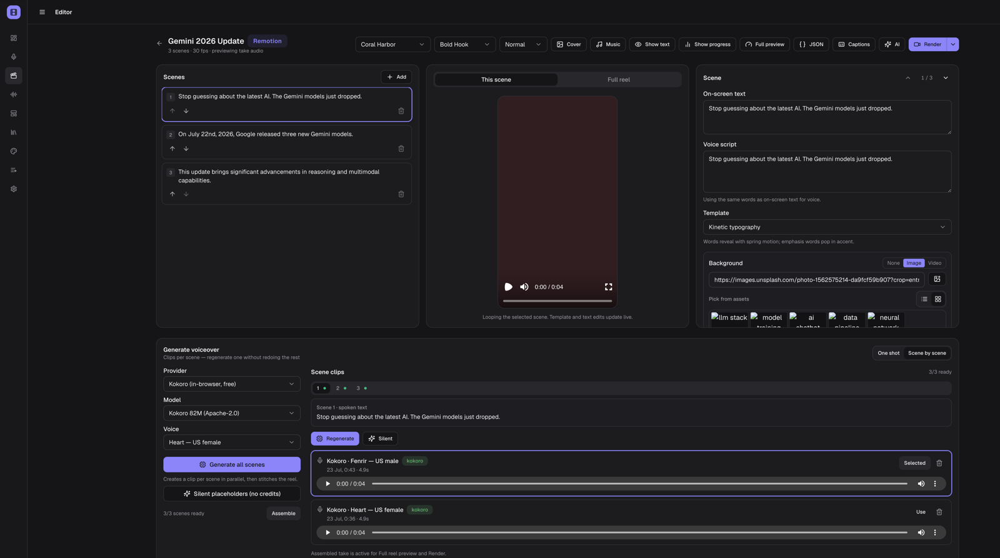
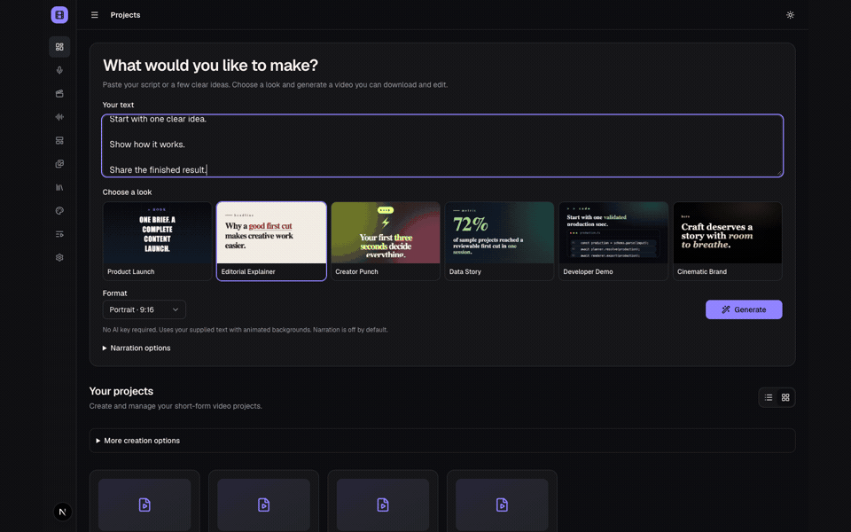
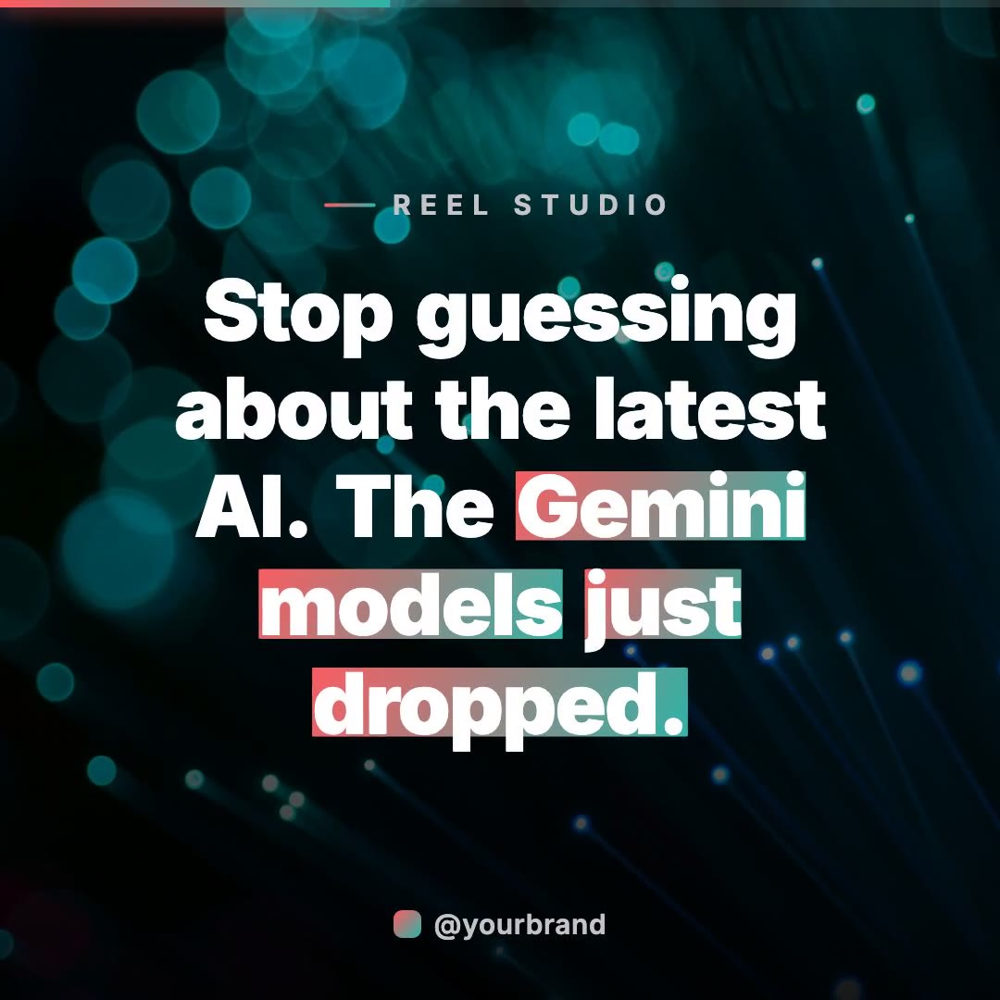

# Reel Studio

[](https://opensource.org/licenses/MIT)
[](https://nodejs.org/)
[](mcp/README.md)

**Turn a brief, script, screenshot, recording, or podcast into finished local content.**

Create Reels, Shorts, explainers, voiceovers, podcasts, and audiograms with a
guided production flow, six production presets, optional AI, and local media
rendering. Use the built-in **MCP server** for bounded unattended production.

Also supports Instagram, YouTube Shorts, TikTok, Facebook, X (Twitter), and
other social formats in **9:16**, **16:9**, and **1:1**.

> **Project status: local-first production release.** The credential-free path,
> optional Quick Produce workflow, both render engines, SQLite-backed jobs, and
> the advertised 36-render example matrix are release-tested. Provider
> integrations remain optional and may evolve.

**MIT-licensed app. Local-first.** Projects and renders stay on your machine
unless you explicitly enable a cloud provider.

> App code is **MIT**. Projects may use **HyperFrames** (Apache-2.0) or
> **Remotion** (separate commercial terms, not OSI). See
> [Licensing](#licensing-summary) and [docs/LICENSING.md](docs/LICENSING.md).

<p align="center">
  
</p>



If Reel Studio helps your workflow, star the repository and tell us which
template or voice provider you want next.

[Quick start](#quick-start) · [Creator guide](docs/CREATOR_GUIDE.md) · [Walkthroughs](docs/WALKTHROUGHS.md) · [MCP](mcp/README.md) · [Roadmap](ROADMAP.md) · [Contributing](CONTRIBUTING.md)

## Local-first release coverage

The 0.4 roadmap contained 28 numbered tasks. The implemented release includes:

- synchronized Node, Next.js, Prisma, HyperFrames, Remotion, UI, and test
  dependency upgrades with fresh and populated-database migration checks
- versioned production specifications, a pinned 23-item HyperFrames catalog,
  shared engine inputs, and six presets rendered by both engines in three ratios
- deterministic and optional AI planning, safe public-page import, uploaded
  media, scene locks, hook alternatives, and selective regeneration
- editable caption tracks with timing provenance, SRT/VTT import/export, and
  versioned appearance presets shared by both render engines
- reusable audio generation, podcast turn caching, intro/outro bumpers, explicit
  pauses, pronunciation rules, WAV/MP3 output, chapters, transcripts, and
  timestamp-grounded audiogram selection
- persistent production jobs, REST/MCP production interfaces, scoped tokens,
  format variants, partial-failure batches, diagnostics, and bundled examples
- an off-by-default Quick Produce path that freezes an immutable submitted
  revision, runs the same durable stages, reconnects after refresh/restart, and
  leaves the editable project independent of its completed output

The detailed implementation audit is in
[docs/production/IMPLEMENTATION_AUDIT.md](docs/production/IMPLEMENTATION_AUDIT.md).
The follow-on local-first expansion and its task ledgers are documented in
[docs/LOCAL_FIRST_EXPANSION.md](docs/LOCAL_FIRST_EXPANSION.md) and
[docs/production](docs/production/).

### Current boundaries

- `npm run dev`, `npm run start`, and the Docker app service supervise the web
  process and durable production worker together. `npm run production:worker`
  remains available only for explicitly managed deployments; do not start a
  second worker for the normal setup.
- The scene editor can search configured Unsplash, Pexels, and Pixabay providers
  by media kind and orientation, preview attribution, and select, replace, or
  clear stock backgrounds. Pexels and Pixabay selections are cached locally;
  compliant Unsplash URLs remain hotlinked. Coverr stays disabled behind its
  unresolved license gate. Scene and AI creation controls support
  `auto/image/video/none`; automatic selection uses stable candidate choice and
  provider fallback while preserving explicit uploads, URLs, and selections.
  Stock videos render muted with deterministic scene timing and cover crops in
  both engines, and output records retain their source attribution snapshots.
- AI planning supports Gemini, OpenAI, Ollama, and LM Studio. Ollama and LM
  Studio use local endpoints configured in Settings; an absent local server is
  reported as an optional provider status. The deterministic no-key planner
  remains available.
- Caption text, timing, typography, placement, colors, box, outline, shadow,
  wrapping, and highlighting are editable. Remotion and HyperFrames consume the
  same versioned caption-style snapshot.
- The catalog is pinned for reproducible saved projects. It does not
  automatically track the full upstream HyperFrames registry.
- AI scene planning uses stable engine capability IDs. The reviewed HyperFrames
  catalog includes three responsive carousel adapters that render only supplied
  project images and retain the project catalog revision.
- Reel Studio does not call generative-video APIs or run model-produced code.

## Who is this for?

Reel Studio is designed for:

- Developers building programmable video workflows
- Creators who want local control over projects and rendering
- Teams experimenting with AI-assisted content production
- AI-agent users who want to generate videos and podcasts through MCP

## From idea to video

1. Choose video, voiceover, podcast, or audiogram
2. Paste a brief or script, import a public page, or upload local media
3. Choose one of six production presets, a brand kit, voice, and canvas
4. Review the deterministic or AI-assisted draft and lock approved material
5. Produce locally and download verified media, captions, and transcripts

### Quick Produce

Create with AI includes an explicit **Quick Produce** toggle. It is off by
default. When enabled, Reel Studio saves the editable project, freezes an
immutable production revision, and immediately queues the normal durable video
pipeline. The no-key option uses the deterministic planner, stock-free fallback,
and server-side Kokoro voice; Ollama, LM Studio, Gemini, OpenAI, and configured
media/voice providers remain optional.

The editor reconnects to the job after refresh and shows persisted stage
progress. Editing while the submitted revision runs never changes that render.
If the current project later differs, Reel Studio reports the revision conflict
and offers either the completed immutable revision as a new editable project or
a new production from the current project.

## Example outputs

| Format                                          | Preview                                                                                          | File                                           |
| ----------------------------------------------- | ------------------------------------------------------------------------------------------------ | ---------------------------------------------- |
| Portrait 9:16 (Reels, Shorts, TikTok, Stories)  | [](docs/assets/examples/portrait-demo.mp4)    | [MP4](docs/assets/examples/portrait-demo.mp4)  |
| Landscape 16:9 (YouTube, X, LinkedIn, Facebook) | [](docs/assets/examples/landscape-demo.mp4) | [MP4](docs/assets/examples/landscape-demo.mp4) |
| Square 1:1 (Instagram, Facebook feed)           | [](docs/assets/examples/square-demo.mp4)          | [MP4](docs/assets/examples/square-demo.mp4)    |

**Podcast sample:** [MP3](docs/assets/examples/podcast-demo.mp3)

## What you get

### Create

- Four-step production wizard plus the full scene editor
- Deterministic no-key planning and optional Gemini / OpenAI / Ollama / LM
  Studio planning
- Product Launch, Editorial Explainer, Creator Punch, Data Story, Developer Demo,
  and Cinematic Brand presets
- Versioned Impact and Editorial text treatments plus Spotlight and Comparison
  bars for supplied data; eligible treatments are chosen in new preset projects
  and adjustable per scene, with the same saved choice rendered in both engines
- Native portrait, landscape, and square layouts in both engines
- Uploaded media, bounded public-page text import, or optional Pexels, Pixabay,
  and Unsplash image/video backgrounds

### Voice

- Browser Kokoro (Apache-2.0, no key) and Web Speech preview
- Cartesia and ElevenLabs (optional keys)
- Optional self-hosted [VoiceForge](https://github.com/mohitkale/voiceforge)
- Full-reel or per-scene takes, plus cached **solo, two-host, and interview podcasts**
- Selective podcast turn regeneration, pronunciation rules, explicit pauses,
  intro/outro bumpers, production WAV/MP3, transcript and chapter exports
- One-click portrait, square, or landscape **audiograms** from manually selected
  or timestamp-grounded suggested turns
- Durable JSON batches with independent portrait, square and landscape reflows, partial-failure recovery and downloadable bundles

### Design

- Motion templates for Remotion and HyperFrames
- Brand kits, editable SRT/VTT captions, background music (bundled CC0)
- Style and Energy looks (for example clean story, bold hook)

### Export and automate

- Local MP4 rendering with queue and progress
- SQLite-backed jobs with leases, recovery, bounded batches, cancellation requests,
  and verified artifacts
- Docker isolation bound to `127.0.0.1`
- **MCP server** for AI-assisted video and podcast workflows ([mcp/README.md](mcp/README.md))

## Video engines

|           | HyperFrames                            | Remotion                      |
| --------- | -------------------------------------- | ----------------------------- |
| Licence   | **Apache-2.0**                         | Remotion License (not OSI)    |
| Templates | HTML motion (`hf-*`)                   | React compositions            |
| Best for  | Apache-2.0 workflows, demos, and forks | Rich React template ecosystem |

See [docs/VIDEO_ENGINES.md](docs/VIDEO_ENGINES.md).

## Local vs optional cloud

| Feature          | Local option                              | Optional cloud            |
| ---------------- | ----------------------------------------- | ------------------------- |
| Voice preview    | Web Speech                                | n/a                       |
| Voice generation | Kokoro / VoiceForge                       | ElevenLabs, Cartesia      |
| Video render     | HyperFrames or Remotion (on your machine) | n/a                       |
| AI planning      | Manual, Ollama, or LM Studio              | Gemini, OpenAI            |
| Backgrounds      | Upload / gradients                        | Pexels, Pixabay, Unsplash |
| Music            | Bundled CC0 / upload                      | Jamendo                   |

Caption timing can come from an imported SRT/VTT file, provider timing, or the
scene timeline. For optional offline speech alignment, install
[whisper.cpp](https://github.com/ggml-org/whisper.cpp) and set
`WHISPER_CPP_BIN` plus `WHISPER_CPP_MODEL` in `.env.local`. The caption editor
and deterministic timing work without whisper.cpp.

Caption appearance supports legacy, minimal, editorial, karaoke, technical, and
cinematic presets. Open the caption editor to adjust typography, placement,
background, outline, shadow, word and line targets, and highlight mode. Saved
tracks keep a versioned snapshot so later preset changes do not restyle them.

See [docs/LOCAL_FIRST.md](docs/LOCAL_FIRST.md).

## Quick start

```bash
git clone https://github.com/mohitkale/reel-studio.git
cd reel-studio
nvm use          # Node 24 LTS
npm install
npm run setup
npm run dev
```

Open [http://localhost:3000](http://localhost:3000).

The normal launcher supervises both the web app and production worker. Run
`npm run demo` for setup + the supervised development server. No cloud keys are required for the
seeded HyperFrames demo or Kokoro voices. Open **Gallery** for bundled examples,
or run `npm run sample:export` for a credential-free local MP4. Run
`npm run doctor` whenever you want to verify the production runtime.

Quick Produce uses server-side Kokoro by default. Its Apache-2.0 model weights
are fetched and cached by `kokoro-js` on first synthesis if they are not already
present; choose voice off or a configured server-capable provider when that
first-use download is unsuitable.

### Manual fallback

```bash
cp .env.example .env.local
npm run db:migrate
npm run seed:demo-brandkit
npm run seed:demo-project
npm run seed:demo-podcast
npm run seed:gallery
npm run dev
```

### Docker

```bash
cp .env.example .env.local   # optional keys
docker compose up --build
```

Compose publishes **`127.0.0.1:3000` only** (not your LAN).
For continuous queue processing in the current development compose setup, run
`docker compose exec app npm run production:worker` in another terminal.

To use a model server running on the Docker host, set its local AI endpoint in
Settings to `http://host.docker.internal:11434` for Ollama or
`http://host.docker.internal:1234` for LM Studio and explicitly enable LAN
access for that provider. This opt-in affects only local AI calls; public media
imports continue to reject private-network targets and redirects.

### Local AI planning

Start Ollama or LM Studio separately, then open **Settings → Local AI director**.
Save the loopback endpoint, run **Check connection**, choose a discovered model,
and save again. Reel Studio does not install, start, or download local models.

- Ollama default: `http://127.0.0.1:11434`; the deterministic fixture targets
  `qwen2.5:7b` or another current 7B+ instruction model with JSON-schema support.
- LM Studio default: `http://127.0.0.1:1234`; load a current 7B+ instruction
  model such as a Qwen 2.5 7B Instruct build. Add a local token only if the LM
  Studio server requires one.

Local configuration is stored in `.data/local-ai-config.json` with owner-only
permissions, separately from cloud keys in `.env.local`. Loopback HTTP works by
default. Private LAN endpoints require explicit opt-in; public or mixed DNS
answers, URL credentials, and redirects are rejected.

## MCP integration

With the app running, generate a legacy approval token or a named scoped token in
**Settings → AI tools / MCP**, then:

```bash
npm run mcp
```

Video and podcast tools: [mcp/README.md](mcp/README.md).

## Security

Built for trusted localhost use. Do not expose it on the public internet without
your own auth layer. See [SECURITY.md](SECURITY.md).

## Roadmap

The current production release includes six cross-engine presets, editable
caption timing and text, persistent jobs, podcast and audiogram workflows,
local AI, optional stock media, styled captions, Quick Produce, scoped MCP
automation, and format-aware batches. The implementation plan and evidence are
in [docs/LOCAL_FIRST_EXPANSION.md](docs/LOCAL_FIRST_EXPANSION.md) and the task
ledgers under [docs/production](docs/production/). The motion graphics expansion
now includes editable type, supplied-data, diagram, and supplied-media treatments
in both video engines. Product frame and Cinematic cover accept images or
video clips; curated footage plays silently beneath narration and holds its
last frame if the scene lasts longer than the clip. Manual and AI creation offer Clean, Expressive, and
Showcase visual ambition; a deterministic sequence planner balances type
reveals, remembers recent layouts on append, and preserves supplied diagram
order and data. Settings and chosen treatments are frozen in production
snapshots. The editor direction menu and `replan_motion_direction` MCP tool
can change ambition or try another variation while preserving content, audio,
media, and locked scenes. Automatic SFX now follow versioned visual anchors
with measured clip peaks, scene bounds, and sparse spacing. The direction menu
also lists treatment compatibility warnings across the video; select a warning
to jump to its scene and fix the supplied inputs or choose another treatment.
Variety suggestions highlight runs of three or more consecutive scenes using
the same active treatment, with a shortcut to review each run.
Visual review generates a scene sheet (up to eight scenes at a time), four
moments of a selected scene, and a 320 px phone-size view. Both engines use
their native still capture with the selected take's matching timing and enabled
captions. Revision-keyed PNGs are cached locally; changed videos require a new
review. Stills review layout; playback remains necessary for motion and sound.
Music → Review music beats analyzes a local track once and saves a reviewable
tempo/phase proposal. Creators can change BPM, shift the first beat, disable
beats and mark a drop; audio fingerprints and optimistic checks protect edits.
Beat maps repeat with the track's loop, are frozen in production snapshots,
and can be edited through `PATCH /api/scripts/:id/music-map` or `edit_music_map`.
They provide directing references; scene and narration timing stays as edited.
Automatic SFX avoid measured spoken-word windows from the audible voice take,
including when captions are hidden. Local transcription retains native token
timing when available; old, imported, estimated, edited or mismatched tracks do
not guess word timing. Manual and locked cues retain creator priority. Existing
databases need `npm run db:migrate` for caption take/frame-rate provenance.
Music → Balance export loudness optionally finishes the complete mix toward
−16 LUFS with a −1 dBTP true peak ceiling. Both engines use two-pass FFmpeg
processing and measure the encoded delivery before marking it complete. Video
packets are copied; authored quiet/loud passages retain their range when linear
gain can meet the loudness/peak target. Finite mixes outside the encoded target
get at most two measured correction passes. A continuous sample clock, authored
start delays and the video endpoint are preserved. Silent/unmeasurable audio
stays untouched. Editor playback uses the original levels. The setting survives
snapshots and revision restore;
REST/MCP `update_script` accepts `audioMastering: "balanced" | "original"`.
Completed production metadata includes the checksum-matched audio report.
Chapters in the editor suggests a draft outline, supports named storyboard
sections and editable scene boundaries, and jumps to each section. Chapters
contain up to 20 scenes, with at most 12 chapters. Saving checks the current
outline and scene order; content and timing are preserved. REST/MCP share
`POST`/`PATCH /api/scripts/:id/chapters`, `suggest_chapters`, and `save_chapters`.
Boundaries and saved sound cues survive revision restore with remapped scene IDs;
per-scene text visibility is preserved. Cues for already-deleted scenes are omitted.
AI → Rewrite scope can target a saved chapter and optionally narrow its scenes.
Each call changes at most 20 unlocked scenes, uses neighboring copy for continuity,
and rejects storyboard edits made during generation. Scene IDs, motion choices,
and copy/asset locks survive. REST/MCP `ai_generate_scenes` accepts `chapterId`
and `sceneIds`; larger storyboards must use bounded selections.
Create production → Chaptered video keeps the full supplied script and builds
editable chapters locally. It supports up to 240 scenes in 12 chapters, with
at most 20 scenes each. Longer drafts warn about export limits without dropping
narration. REST `/api/projects/manual` and MCP `create_production_draft` accept
`structure: "chapters"`; topic-based AI generation still uses bounded calls.
Valid saved chapter plans at 24/30/60 fps support production up to 300 seconds;
other video storyboards and standalone audio retain their 180-second limits.
Named MCP token allowances remain unchanged. Video jobs freeze their duration
policy and check actual prepared timing after synthesis, including the cover.
Submission uses only the explicitly selected, matching take, otherwise the
same estimated timeline as preview/export.

Saved chapter projects now export in bounded sections, preserving global frame
timing. Remotion uses chapter boundaries with a 30-second cap; HyperFrames uses
native 30-second chunks at 24/30/60 fps. Checksum-verified sections in
`media/render-cache` survive retry of unchanged inputs. Remotion requires frozen
local media for this path; other jobs keep the existing whole-video renderer.
Audio is mixed continuously and muxed once, then optionally mastered. Short local
music tracks are expanded for HyperFrames export to preserve looping. Recent
retry caches are retained; inactive caches are trimmed toward 1 GiB and expire
after seven days. Changes currently invalidate the whole composition cache.
HyperFrames validates the native plan manifest and keys silent sections from
their frozen inputs, excluding the freshly encoded assembler-only audio mix.
Refresh keeps manual, legacy, muted, and locked cues; existing scenes retain their template
cue behavior. Music → Adjust sound cues lets creators choose the clip, set its
level (including mute), shift its timing, or restore automatic direction.
Edits also work through `PATCH /api/scripts/:id/sfx` and the `edit_sfx_cue` MCP
tool; a stale cue is rejected with 409 instead of overwriting a newer edit.
Its remaining scope is in
[docs/production/MOTION_GRAPHICS_PLAN.md](docs/production/MOTION_GRAPHICS_PLAN.md).
Follow longer-term work in
[ROADMAP.md](ROADMAP.md).

## Contributing

- [CONTRIBUTING.md](CONTRIBUTING.md)
- [CODE_OF_CONDUCT.md](CODE_OF_CONDUCT.md)
- [CONTRIBUTORS.md](CONTRIBUTORS.md)

### Contributors

- **[Mohit Kale](https://github.com/mohitkale)**: creator and maintainer
- **[Cursor](https://cursor.com)** / **[Cursor Agent](https://github.com/cursoragent)**: pair programmer and first AI contributor

## Architecture


Stack: Next.js App Router, TypeScript, Prisma + SQLite, Remotion and/or
HyperFrames, TanStack Query, Zod.

### Key modules

1. `src/app`: pages and API routes (including `/podcasts`)
2. `src/library`: repositories, render and take services, storage
3. `src/engines`: Remotion / HyperFrames adapters
4. `src/providers`: AI and voice providers
5. `src/compositions`: Remotion templates
6. `scripts/`: setup, seeds, HyperFrames worker

## Available scripts

| Script                                        | Purpose                                     |
| --------------------------------------------- | ------------------------------------------- |
| `npm run setup`                               | First-run setup (safe to re-run)            |
| `npm run demo`                                | Setup + start dev server                    |
| `npm run doctor`                              | Check the local production runtime          |
| `npm run sample:export`                       | Render a credential-free sample MP4         |
| `npm run release:check`                       | Run the fast 0.4 release contract checks    |
| `npm run release:matrix`                      | Render all 36 preset/engine/format outputs  |
| `npm run dev`                                 | Start supervised dev web + worker           |
| `npm run build` / `start`                     | Build / run supervised production services  |
| `npm run production:worker`                   | Continuously process the persistent queue   |
| `npm run lint` / `typecheck` / `test`         | Quality checks                              |
| `npm run security:scan`                       | Secret pattern scan                         |
| `npm run prepare:hooks`                       | Enable `.githooks`                          |
| `npm run db:migrate`                          | Safely apply versioned database migrations  |
| `npm run seed:gallery`                        | Install bundled examples into local media   |
| `npm run seed:demo-project`                   | Seed HyperFrames demo reel                  |
| `npm run seed:demo-podcast`                   | Seed short demo podcast                     |
| `npm run test:podcast-audiogram -- <take-id>` | Render and verify a podcast-to-video sample |
| `npm run seed:demo-brandkit`                  | Seed Coral Harbor brand kit                 |
| `npm run seed:assets`                         | Sample SVG/Lottie assets                    |
| `npm run sync:hf-catalog`                     | Sync the reviewed pinned HF catalog         |
| `npm run mcp`                                 | MCP server                                  |
| `npm run studio`                              | Remotion Studio                             |

## Environment variables

See [`.env.example`](.env.example). Minimum for local use without cloud
providers: `DATABASE_URL` (created by setup).

## Licensing summary

| Component                                                            | Terms                                                              |
| -------------------------------------------------------------------- | ------------------------------------------------------------------ |
| Reel Studio app, templates, MCP code                                 | **MIT**                                                            |
| Bundled music (`public/music/`)                                      | **CC0**                                                            |
| **Remotion**                                                         | **Remotion License** ([details](https://www.remotion.dev/license)) |
| **HyperFrames**                                                      | **Apache-2.0**                                                     |
| Kokoro TTS                                                           | Apache-2.0                                                         |
| Optional cloud providers                                             | Each vendor's terms                                                |
| VoiceForge engines ([repo](https://github.com/mohitkale/voiceforge)) | Per-engine (may be non-commercial)                                 |

Full matrix: **[docs/LICENSING.md](docs/LICENSING.md)**.

## More docs

- [docs/LOCAL_FIRST.md](docs/LOCAL_FIRST.md)
- [docs/CREATOR_GUIDE.md](docs/CREATOR_GUIDE.md)
- [docs/WALKTHROUGHS.md](docs/WALKTHROUGHS.md)
- [docs/VIDEO_ENGINES.md](docs/VIDEO_ENGINES.md)
- [docs/VOICE_PROVIDERS.md](docs/VOICE_PROVIDERS.md)
- [docs/TEMPLATE_AUTHORING.md](docs/TEMPLATE_AUTHORING.md)
- [docs/LICENSING.md](docs/LICENSING.md)
- [docs/production/IMPLEMENTATION_AUDIT.md](docs/production/IMPLEMENTATION_AUDIT.md)
- [docs/LOCAL_FIRST_EXPANSION.md](docs/LOCAL_FIRST_EXPANSION.md)
- [CHANGELOG.md](CHANGELOG.md)

### Production regression checks

`npm run test:unit` runs credential-free unit tests. `npm run test:render`
renders a legacy fixture through both engines. `npm run test:stock-video-render`
generates a credential-free local video with an audio track, renders it muted
through both engines in portrait, landscape, and square, and verifies codec,
dimensions, duration, visible content, and absence of leaked stock audio.
`npm run release:matrix` renders all six presets through both engines in all
three layouts. Artifacts stay under `.artifacts/`; the manual Quality workflow
retains them for inspection. Rendering requires Chromium and may download it
during initial setup. Composition fonts and motion runtime files are bundled
locally before frame rendering.

### Database upgrades

Stop the app before running `npm run db:migrate`. Existing recognized v0.3.0 databases are backed up beside the SQLite file and baselined before versioned migrations run. Unknown schemas are rejected. Relative `file:./dev.db` URLs continue to resolve under `prisma/`. To roll back, stop the app, restore the matching backup and application version together, and keep the media directory. Setup and Docker use this migration path.

### Supervised production worker

`npm run dev` and `npm run start` launch Next.js and the durable production worker
under one supervisor. Build first with `npm run build` for production. Docker
uses the same launcher. Both processes inherit the same Next.js environment
configuration and SQLite URL. Do not launch another worker for the normal setup.
Worker crashes are logged and restarted with bounded backoff (five attempts);
a web crash or exhausted restart budget stops the pair with a nonzero exit.
Ctrl+C/SIGTERM stops both, with a ten-second forced shutdown bound. Durable
leases recover interrupted local rendering. Shutdown requeues local video jobs
with their saved stages; interrupted audio/provider jobs require explicit retry
to avoid repeating an uncertain paid request. `npm run production:worker` remains available
for explicitly managed deployments; routes retain their fallback when the app
is launched directly without the supervisor.

Video production jobs capture an immutable script/engine/brand/caption/take
snapshot at submission. Selected local assets are preserved under
`media/production-assets/` with content hashes; remote stock URLs remain network
sources. Each stage saves a validated output and invalidation key in the existing
SQLite job-step records. Retries reuse valid stages and verified renders, and
never synthesize a new paid voice implicitly. Existing queued video inputs are
snapshotted on their first execution; older projects and REST/MCP requests retain
their current formats.

Quick Produce adds a `ProductionRevision` above that immutable production
snapshot. UI, REST, MCP, and batch submissions use the same strict options and
job model. A repeated idempotency key returns the original revision/job, while a
new submission from edited content creates a new revision instead of mutating a
completed artifact.

Run `npm run test:production-worker` for isolated real exports and active
cancellation through both engines. It creates a fresh test database and evidence
under `.artifacts/`, checks every persisted stage, and verifies renderer children
and partial output files are gone after cancellation. It uses installed local
rendering tools and does not modify existing project rows.

The Docker image includes `procps` for renderer process-tree cleanup and `unzip`
for Chromium archive extraction. Its default command starts the supervisor directly
so container stop signals reach both children. It uses the existing CPU Kokoro provider and
skips optional ONNX CUDA binary downloads during dependency installation. It does not install GPU
drivers or change host configuration.
