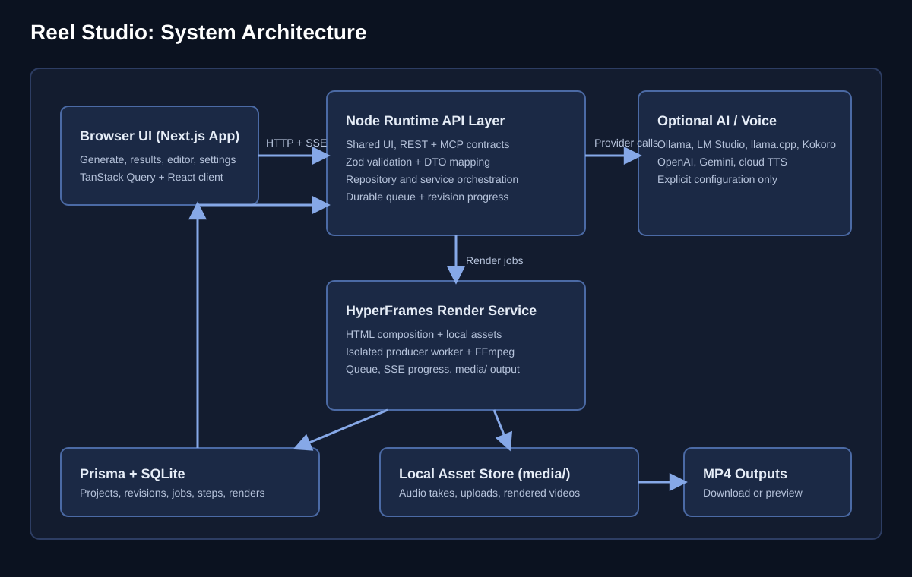
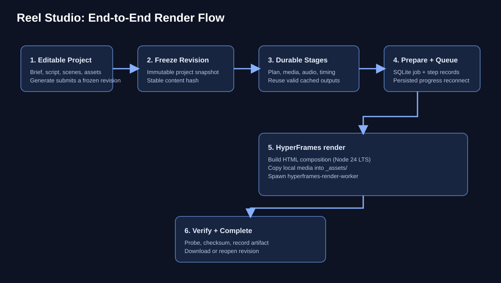

# Architecture

Reel Studio is a local-first Next.js app with Prisma/SQLite storage,
HyperFrames rendering, and optional AI/voice/media providers.

## Boundaries

| Area                      | Responsibility                                                     |
| ------------------------- | ------------------------------------------------------------------ |
| `src/app`, `src/server`   | Pages, authenticated/validated API handlers, progress streams      |
| `src/library`             | Repositories, assets, render/take orchestration                    |
| `src/production`          | Immutable specifications/revisions, durable jobs, stages, policies |
| `src/providers`           | AI, voice, stock, and music transports                             |
| `src/engines/hyperframes` | Catalog, HTML composition, authored motion, isolated export        |
| `src/video`               | Engine-neutral scene, timing, brand, motion, and layout contracts  |
| `mcp`                     | Stdio tools calling the same REST API with scoped credentials      |
| `scripts`                 | Supervision, render workers, setup, migration, and verification    |

## From source to output

1. Manual/deterministic or configured AI planning creates an editable project.
2. Generate freezes a production revision and queues the durable stages.
3. Stages resolve/copy eligible media, reuse or generate audio, prepare timing,
   compile the composition, render, and verify the artifact.
4. SQLite stores progress/results; reconnect reads durable state.
5. Outputs retain their submitted revision while later edits remain independent.

Preview/export share resolved layout, timing, brand, caption, and local runtime
inputs. HyperFrames is the only supported engine. Existing legacy projects map
to current templates; immutable historical provenance and MP4s remain intact.

[Production contracts](production/CONTRACTS.md) own wire/snapshot details;
[runtime](RUNTIME.md) owns supervision and recovery;
[extensions](EXTENSIONS.md) owns provider/block registration.
