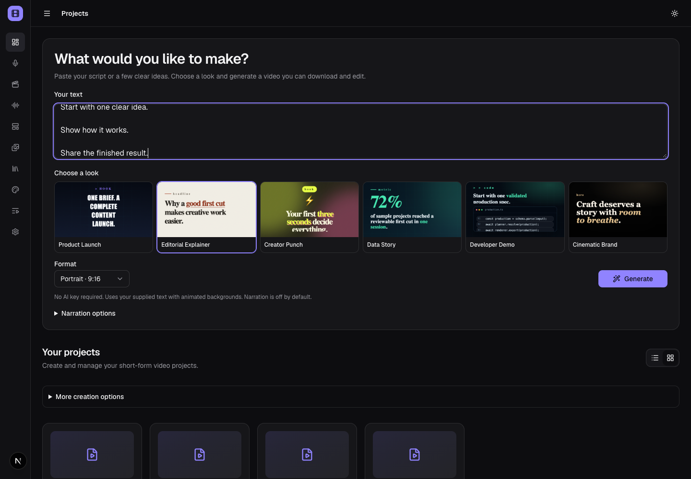
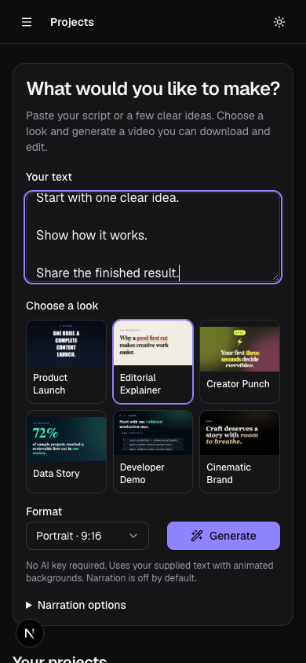
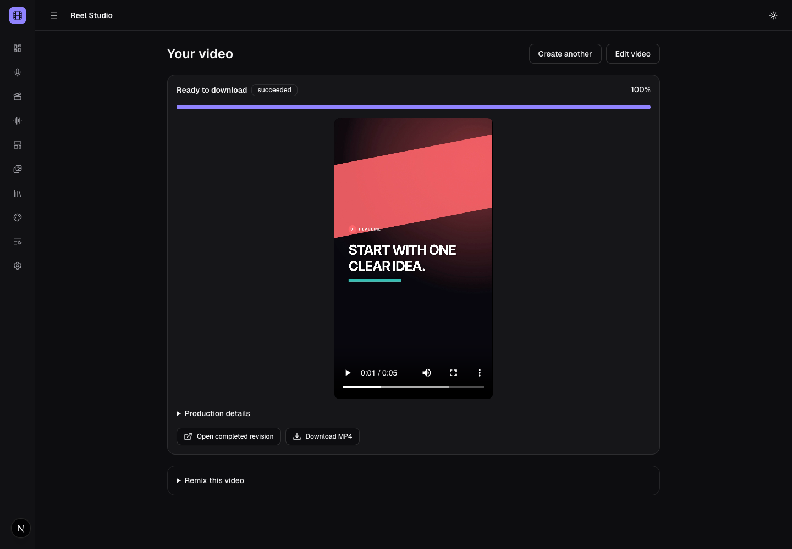
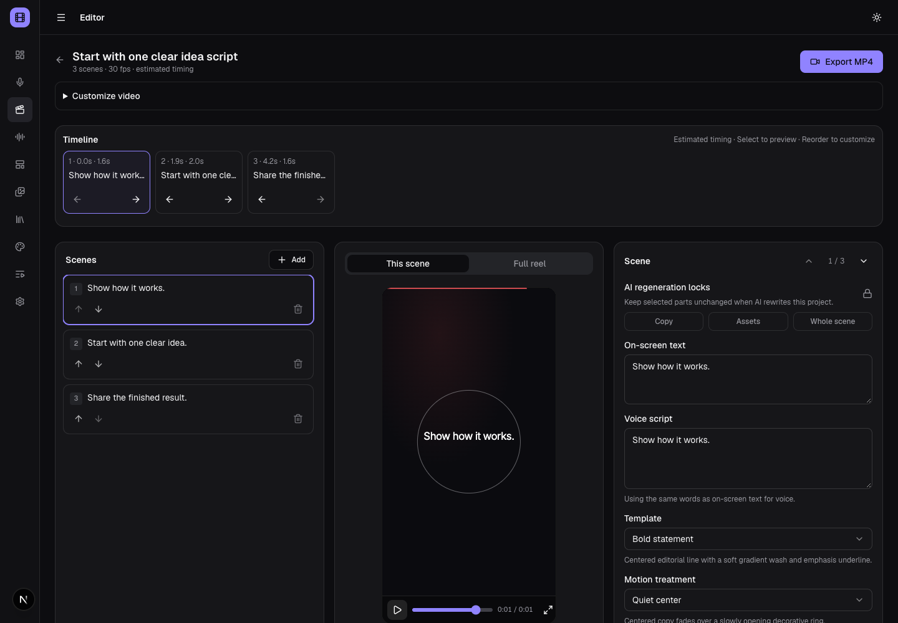

# Creation and editing UX

The home page starts with supplied text, six visual preset examples, a format
and one **Generate** action. It uses the deterministic director with zero paid
planner calls, stock-free animated backgrounds and narration off. Optional
configured local narration is explicit. **More creation options** retains blank
projects, the guided import/upload flow and configured AI planning.

Generate submits the existing durable production pipeline with an idempotency
key and opens `/results/<job-id>`. The result URL reconnects after refresh and
shows saved progress, errors/cancel/retry, verified downloads, MP4 playback,
**Edit video**, and **Remix this video**. Remix prefills the current editable
project's complete scene narration and generates a separate project/result.
Existing submitted outputs retain their frozen revision. Paid work is not
replayed automatically.

The editor keeps **Export MP4** visible. **Customize video** contains detailed
brand, motion, review, voice/caption and export controls, which wrap within the
viewport. The scene timeline shows current narration or estimated timing,
selects preview positions and saves earlier/later scene ordering through the
existing scene API. It does not rewrite measured narration timestamps; duration
labels are informational. The editor uses its own player instead of duplicating
the result video. The sidebar version comes from package metadata.

## Verification

Use [the walkthroughs](WALKTHROUGHS.md) on desktop/mobile. Check prompt → result →
playback/download, persisted scene reordering, reconnect, and separate remix.
Regenerate preset examples with `npm run preset:previews` and installed Chrome.
Screenshots show the v0.4.0 UI; each creator's source/brand determine the output.
Published browser evidence is in [release validation](production/RELEASE_VALIDATION.md).
