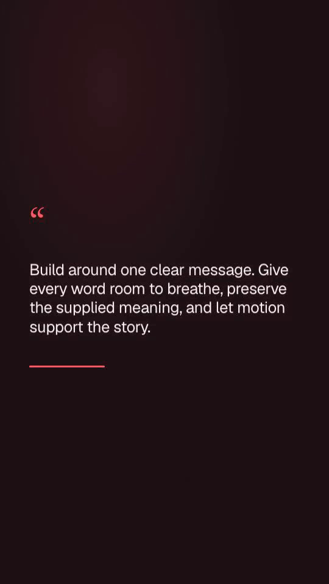

# Provider and authored-block extensions

Local planning providers register in `src/providers/ai/local-definitions.ts`.
IDs, Zod schemas, configuration defaults, labels, settings cards, diagnostics
and factories derive from these definitions. A new OpenAI-compatible local
server needs one registration with a label, protocol and defaults; there is no
separate provider enum to edit. Ollama keeps its native protocol. Gemini and
OpenAI retain their fixed-origin cloud transports and separate credentials.

The **llama.cpp** registration uses `/v1/models`, schema-constrained
`/v1/chat/completions`, optional local authentication, the existing endpoint
policy, cancellation and one bounded structured-output repair. Video planning,
podcast planning and clip suggestions use the shared compatible adapter.
Default endpoint: `http://127.0.0.1:8080`. Start an existing `llama-server`
separately and discover/select its model in Settings. Model loading, server
context size and model licenses remain the server owner's responsibility.
Reel Studio does not download or start a model. The upstream API contract is
in the [llama.cpp server guide](https://github.com/ggml-org/llama.cpp/blob/master/tools/server/README.md).

Authored extensions register data in `src/video/motion-extensions.ts` and a
renderer/styles entry in
`src/engines/hyperframes/motion/registered-blocks.ts`. Recipe IDs, editor options,
validation and timeline landmarks derive from those definitions. Core dispatch
calls the registry before the existing authored families. Registration tests
require every declared extension to have a renderer. Supply the block's actual
copy/media compatibility rules and frozen landmarks; never accept executable
HTML, CSS or JavaScript from project data.

The **Margin quote** block renders supplied quotation text, an opening mark
and a restrained rule. Quote-role selection is deterministic, and users can
choose the recipe in the editor. It preserves brand typography/palette, supports
up to 140 characters, reduces type size for longer copy, and falls back when a
scene contains media, chart data, list items, hidden copy or incompatible text.
It adds no speaker attribution or invented quotation. Existing saved recipe IDs
and versions remain valid. Generic line entrances now declare their starting
percentage explicitly so font-loading timing cannot change preview/export seeks.

## Shared helpers and compatibility audit

- `src/lib/html.ts` escapes copy and quoted HTML attributes across composition,
  preset, motion, catalog and audiogram builders. CSS strings, URLs and script
  serialization keep their dedicated validation/escaping. Catalog text-only
  replacement retains its narrower semantics.
- `src/lib/serial-queue.ts` provides FIFO work, optional bounded admission and
  recovery after a rejected operation. Visual review retains its four-request
  bound; config updates and paid-request reservations share the failure-safe
  serialization primitive. Database job leases and cross-process claiming are
  unchanged.
- `src/server/sse.ts` shares no-cache/no-transform/framing headers between the
  bounded progress stream and the backpressured VoiceForge proxy. The proxy
  retains its upstream body and cancellation signal.
- Unused catalog DOM extraction, metadata lookup, used-block enumeration and
  no-op `inlineCatalog` options were removed after auditing all consumers.
  Native-only data/media/carousel adapters no longer materialize unused upstream
  HTML during render staging. A regression writes the real project and checks
  that the metric is retained with no unused composition file.
- Current catalog selections feed import/checksum/capability gates; prior
  revisions and the embedded v0.3 catalog still serve saved-project compatibility
  or factual-input validation. Those used artifacts remain. Lottie remains a
  working uploaded-asset preview, so its dependency is retained.
- Historical local-first task ledgers are in `docs/production/archive/`.
  Active documentation links and release-check paths were updated; historical
  JSON evidence remains in place and is explicitly historical.

## Verification

The real loopback HTTP fixture exercises llama.cpp registration, config persistence
and secret-free client views, model discovery, all three planning APIs, local
authentication failure and cancellation. It validates the transport contract;
it does not claim live-model output quality. Existing LM Studio, Ollama and cloud
provider tests remain part of the full suite. FIFO admission/error recovery and
new recipe registration/escaping/fallback are covered directly.

`npm run test:extensions` uses installed Chrome, freezes the shipped local
runtime, verifies forward/backward native seeks and preview/producer parity,
then exports four-second 30 FPS MP4s in all three ratios with the isolated
worker. The complete supplied quotation, opening mark and rule were inspected
in exported frames. No external requests, paid calls or model downloads were
used. Reports stay under `.artifacts/m14-extensions/`; current release evidence is in
[release validation](production/RELEASE_VALIDATION.md).
